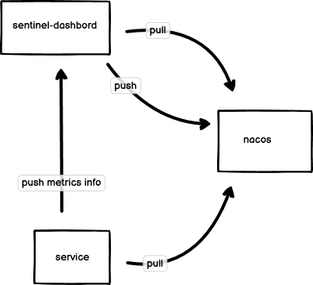

# Sentinel-NACOS 控制台

## 1. 改造思路、问题及解决方案



改造 Sentinel 控制台，将规则由sentinel推送到各个服务端点改成持久化到 Nacos 中。

#### Q1: 改造是否改动前后端代码？
  本次改造不涉及前端代码，只改修改后端部分入口代码
#### Q2: 针对不同服务项目，且命名空间不同如何完成Nacos配置发布和订阅？
  查过官方文档【https://nacos.io/blog/faq/nacos-user-question-history8193/ 】了解，nacos不支持多namespace客户端访问，解决方案可通过构建多客户端解决订阅和发布问题  
#### Q3: 如何完成多客户端的动态新增？
  新增Nacos配置文件[sentinel-namespace-config.yaml]详细查看【 com.alibaba.csp.sentinel.dashboard.datasource.nacos.NacosConfigClientProvider 】，通过nacos动态配置，完成多服务端项目接入Nacos，且有不同命名空间情况下，构建租户隔离客户端来发布和拉取配置使用

## 2. 接入规则
```
2.1 sentinel-dashborad配置：

2.1.1 dashborad 工程增加nacos配置

sentinel.nacos.server-addr=xxx
sentinel.nacos.username=xxx
sentinel.nacos.password=xxxx
sentinel.nacos.namespace=xxxxx

2.1.2在nacos对应的命名空间和group下新增sentinel-namespace-config.yaml配置文件，
  # 配置规则类型，对应值如下：
    sentinel-service:
       source:
         - name: {appName}
           namespace: {namespace}
         ....  

2.2 服务端配置文件取以下规则配置：
   GROUP = 'SENTINEL_GROUP'
   flow 命名规则 ：{服务名}-flow-rules
   gw 命名规则 ：{服务名}-gw-flow-rules
   system 命名规则 ：{服务名}-system-rules
   authority 命名规则 ：{服务名}-authority-rules
   degrade 命名规则 ：{服务名}-degrade-rules
 

```
